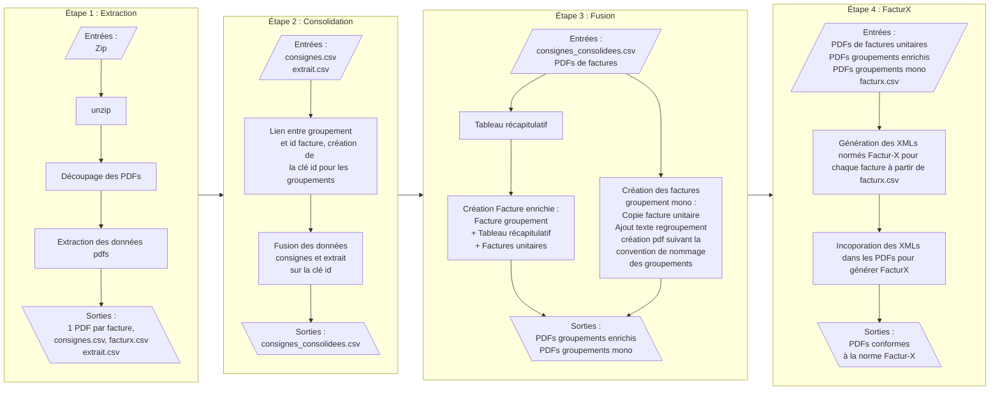

# Atelier Facture

## Fonctionnement général



## Étape 1 : Extraction

L'étape d'extraction se concentre sur l'analyse et la transformation initiale des fichiers PDF contenus dans des archives (ZIP). Elle permet d'extraire les informations essentielles et de structurer les fichiers pour les étapes suivantes.

### Description des actions principales

#### Identification récursive des PDF dans le ZIP

- **Recherche de tous les fichiers PDF**, y compris dans des ZIP imbriqués.
- **Extraction des PDF trouvés** dans un dossier temporaire.

#### Analyse de chaque PDF

Pour chaque fichier PDF extrait, la fonction `extract_and_format_data` est utilisée pour analyser chaque page et rechercher un ensemble de motifs prédéfinis :

```python
patterns = {
    'id': r"N° de facture\s*:\s*(\d{14})",
    'date': r'VOTRE FACTURE\s*(?:DE\s*RESILIATION\s*)?DU\s*(\d{2})\/(\d{2})\/(\d{4})',
    'pdl': r'Référence PDL : (\d+)',
    'groupement': r'Regroupement de facturation\s*:\s*\((.*)\)',
    'membre': r'Nom et Prénom ou\s* Raison Sociale :\s*(.*?)(?=\n|$)'
}
```

Ces motifs permettent d'extraire :

- **id** : Numéro de facture (14 chiffres).
- **date** : Date de la facture.
- **pdl** : Référence PDL.
- **groupement** : Regroupement de facturation.
- **membre** : Nom ou raison sociale.

Les données recherchées sont présentes uniquement sur la première page de chaque facture. Cela permet d'identifier les plages de pages correspondant à chaque facture.

#### Découpage et création des PDF individuels

Pour chaque couple (données extraites, plage de pages), un nouveau PDF est généré en suivant les conventions définies dans `file_naming.py`.

Les opérations incluent :

- **Copie des pages de la plage** dans un nouveau PDF pour chaque facture identifiée.
- **Application de correctifs au texte du PDF** si nécessaire (ex. remplacement d'informations, amélioration de la lisibilité des regroupements).
- Les fichiers générés sont stockés dans le dossier **extrait**.
- Chaque fichier découpé et les données associées sont enregistrés dans une dataframe `extrait`.

#### Export des fichiers CSV

Deux fichiers CSV sont extraits du ZIP d'origine et écrits dans le dossier extrait :

- **consignes.csv** : Contient des informations spécifiques pour les étapes suivantes.
- **facturx.csv** : Données structurées pour l'intégration FacturX.
- La dataframe `extrait`, contenant toutes les informations acquises pendant la procédure d'extraction, est également exportée en CSV sous le nom **extrait.csv**.

### Organisation des fichiers générés

- Les nouveaux PDF découpés et corrigés sont stockés dans le dossier **extrait**.
- Les fichiers CSV produits :
  - **consignes.csv** : Contient les instructions nécessaires à la consolidation et fusion.
  - **facturx.csv** : Fournit les données nécessaires pour l'enrichissement FacturX.
  - **extrait.csv** : Liste les pdfs extraits, leurs données associées et leur emplacement.
  
### Points importants

- Cette étape utilise les motifs définis pour **identifier et découper les factures**.
- **Les corrections appliquées aux PDF** sont adaptées aux besoins spécifiques (remplacement d'informations, amélioration de la lisibilité).

Bien que les fonctions utilisées soient prévues pour, il n'y a pour l'instant pas de mécanique de personnalisation par l'utilisateur·ice. Un chargement dynamique par YAML peut être envisagé.

---

## Étape 2 : Consolidation

Le principe est simple : on utilise les deux fichiers **consignes.csv** et **extrait.csv** qui représentent respectivement ce qui est attendu et ce que l'on a effectivement réussi à extraire, pour préparer les étapes suivantes. Ces fichiers sont chargés dans des dataframes.

### Exemple de tableau de consignes

| id   | pdl           | groupement | membre   | Nom du site | Puissance (kVA) | Volume (kWh) |
|------|---------------|------------|----------|-------------|----------------|--------------|
|      |               | A          | Membre 1 | Site 1      | 10             | 1000         |
| ID02 | 10000000000001| A          | Membre 1 | Site 2      | 20             | 2000         |
| ID03 | 10000000000002| A          | Membre 1 | Site 3      | 30             | 3000         |
| ID04 | 10000000000003| A          | Membre 1 | Site 4      | 40             | 4000         |
|      |               | B          | Membre 2 | Site 5      | 50             | 5000         |
| ID06 | 10000000000005| B          | Membre 2 | Site 6      | 60             | 6000         |
| ID07 | 10000000000006| G          | Membre 2 | Site 7      | 70             | 7000         |
| ID08 | 10000000000007|            | Membre 3 | Site 8      | 80             | 8000         |
| ID09 | 10000000000008|            | Membre 4 | Site 9      | 90             | 9000         |
| ID10 | 10000000000009| J          | Membre 5 | Site 10     | 100            | 10000        |

### Détection du type d'opération

Pour chaque ligne de la table de consignes :

- **Si le PDL est vide**, alors c’est un groupement à enrichir.
- **Sinon**, si le groupement associé est unique (par exemple **G** ou **J**), c’est un groupement mono PDL.
- **Sinon**, c’est une facture unitaire.

### Lien entre groupement et ID facture

- Lien entre le groupement et l'ID de la facture de groupement associée.
- Création de la clé **id** pour les groupements dans la dataframe consignes.

### Fusion des données

Les données des fichiers **consignes** et **extrait** sont fusionnées sur la clé **id** (extraite dans consigne), ce qui permet de récupérer (entre autres) la colonne **fichier_extrait** qui contient le chemin du PDF de facture correspondant à chaque ligne de la table consignes.

### Vérifications

À partir de là, il est possible d'opérer diverses vérifications :

- **Vérifier qu'on a bien extrait toutes les factures attendues**.
- **Identifier si une facture inattendue a été extraite**.

### Dataframe consignes_consolidées

La dataframe `consignes_consolidées` contient toutes les informations nécessaires pour réaliser les étapes suivantes. Un export CSV est réalisé sous le nom **consignes_consolidées.csv**.

# Doc plus très à jour passée ce titre 😓

## Description

Ce programme permet de préparer et consolider des factures pour leur destination finale. Il traite 4 types de facturations :
    - Les factures unitaires
    - Les factures unitaires destinées à des acteurs publics
    - Les factures de groupements, comprenant de multiples PDL, destinées à des acteurs publics
    - Les factures de groupements, comprenant un mono PDL, destinées à des acteurs publics

Ces 4 facturations sont toutes crées à partir de deux type de factures (unitaire et de groupement).
Ces factures sont d'abord extraites de pdfs contenant plusieurs factures sans distinction de type, ces pdfs étant eux mêmes extrait d'une ou plusieurs archives zip. Chaque zip est traité comme un _batch_ de factures à traiter, ce qui permet de suivre l'avancement du traitement.

### La vie d'une facture unitaire

Les factures unitaires sont extraites puis stockées dans le dossier _indiv_. Certaines métadonnées dans le texte du pdf sont également stockés dans les métadonnéès du pdf afin d'en faciliter le traitement ultérieurement. Quelques modifications au texte du pdf sont effectuées.

### La vie d'une facture unitaire destinées à des acteurs publics

Les factures unitaires destinées à des acteurs publics sont copiées depuis le dossier _indiv_ et transformées en Factur-X (pour dépôt sur Chorus Pro).

### Les factures de groupements, multi pdl

Une facture de groupement qui est un condensé comportant l'ensemble des lignes des factures des factures unitaires des PDL du groupement, sont extraites puis stockées dans le dossier portant le nom du groupement. Les métadonnées de ces factures sont également stockées dans les métadonnées du pdf, et quelques modifications au texte du pdf sont effectuées.

On ajoute par la suite un tableau récapitulatif des factures des PDL du groupement, et on Concatène toutes les factures unitaires correspondantes, pour former une facture de groupement consolidée.

Enfin, ces factures consolidées sont transformées en Factur-X (pour dépôt sur Chorus Pro).

### Les factures de groupements, mono PDL

Les factures de groupements, mono PDL sont en réalité des factures unitaires,
elles sont donc copiées depuis le dossier _indiv_,
puis on vient ajouter dans le texte du pdf le nom du regroupement.
Elles sont enfin transformées en Factur-X (pour dépôt sur Chorus Pro).

## Étapes de traitement

### Étape 1 : Traitement du(des) zip(s) d'entrée

En utilisant l'option _-i_ ou _--input_, on indique le chemin vers le dossier contenant les archives zip ou un seul zip.

Chaque zip est un _batch_ de factures à traiter, aussi, nous parlerons de batch pour désigner l'ensemble des factures contenues dans un zip.
et le batch _nombatch_ empruntera son nom au zip _nombatch.zip_.
Tous les pdfs contenus dans les archives zip sont extraits dans un dossier temporaire. Puis les pdfs sont parcourus et les factures sont extraites et stockées dans un dossier de sortie en fonction de leur type :

- Les factures unitaires sont stockées dans le dossier _indiv_
- Chaque facture de groupement est stockée dans un sous dossier _nombatch_

La distinction entre les deux types de facture est faite en fonction de la présence ou non du texte _Regroupement de facturation : nomgroupement_ dans le pdf. C'est ce _nomgroupement_ qui est utilisé pour nommer le sous dossier et **qui sert de clé pour faire le lien** avec les données de traitement.

Ces données, contenues dans chaque zip d'entrée sous la forme d'un fichier _nombatch.xslx_ et un fichier _BT\_*.csv_ sont également extraites dans le sous dossier _nombatch_.

À la fin de cette opération, un espace de travail est créé --ou mis à jour-- dans le dossier _nomatelier_ passé en paramettre.

Par exemple, si l'on lance la commande suivante et que le dossier d'entrée contient deux zips _batch\_1.zip_ et _batch\_.zip_ :

``` bash
python atelier_facture.py /chemin/vers/nomatelier -i /chemin/vers/entrées/ 
```

```bash
_nomatelier_/
├── indiv
│   ├── facture_unitaire_1.pdf
│   ├── facture_unitaire_2.pdf
│   └── facture_unitaire_42.pdf
├── batch_1
│   ├── facture_groupement_1.pdf
│   ├── facture_groupement_2.pdf
│   ├── facture_groupement_3.pdf
│   ├── batch_1.xslx
│   └── BT_batch_1.csv
└── batch_2
    ├── facture_groupement_1.pdf
    ├── facture_groupement_2.pdf
    ├── facture_groupement_3.pdf
    ├── batch_2.xslx
    └── BT_batch_2.csv
```

Ces fonctionnalitées sont définies dans _extraction.py_.

### Étape 2 : Liste des dossiers dans l'atelier

Chaque dossier dans l'atelier heberge les fichiers nécessaires pour le traitement d'un ensemble _batch_ de factures. D'autres sous dossiers seront ajoutés ici au fur et à mesure du traitement.
Lorsque l'option _-f_ ou _--force_ est passée en paramètre, on supprime ces sous-dossiers existants, ce qui permet d'en forcer le recalcul.

### Étape 3 : Traitement de chaque batch

On itére sur les dossiers de l'atelier, et on traite indépendamment chaque batch de factures. Ce traitement est décrit par les 2 étapes suivantes.

#### Étape 3A : Fusion des factures

Cette étape à deux objectifs :

- Créer un pdf de groupement enrichi pour les groupements multi pdl
- Copier et modifier le pdf unitaire correspondant pour les groupements mono pdl

Ces fonctionnalitées sont définies dans _fusion.py_.

##### Multi pdl

Ici, on vient lire le _nombatch.xslx_. Ce fichier contient des informations sur un ensemble de pdl à facturer, ainsi que le groupement associé.
On identifie en premier lieu les groupements multiples, simplement ceux qui ont plus d'un pdl, cad qui apparaissent plus d'une fois dans le fichier.

Puis, **pour chaque groupement multiple** identifié :

- on crée un dossier _nombatch/fusion/nomgroupement_ .
- on copie les lignes correspondantes au groupement de _nombatch.xslx_ dans un fichier _nombatch/fusion/nomgroupement/nomgroupement.xlsx_ qui sera utilisé pour créer le tableau récapitulatif.
- on copie le pdf de groupement vers _nombatch/fusion/nomgroupement/nomgroupement.pdf_
- on copie tous les pdfs de factures individuelles depuis _nomatelier/indiv_ vers _nombatch/fusion/nomgroupement/_ (on les identifie grace au numéro de pdl)
- on crée un tableau récapitulatif à partir de _nombatch/fusion/nomgroupement/nomgroupement.xlsx_ nommé _nombatch/fusion/nomgroupement/Table_nomgroupement.pdf_
- On concatène dans l'ordre : le pdf de groupement, le tableau récapitulatif, et les pdfs de factures individuelles dans un pdf nommé _nombatch/group_mult/AAAAMMDD\_membre\_nomgroupement.pdf_

Fini !

##### Mono pdl

De manière analogue, on identifie les groupements mono pdl, cad qui n'apparaissent qu'une fois dans le fichier _nombatch.xslx_.

Puis, **pour chaque groupement mono** identifié :
On trouve le pdf de facture individuelle correspondant au pdl, on y ajoute dans le texte du pdf et dans ses métadonnées le nom de groupement. puis on l'enregitres avec la convention groupement dans _nombatch/group_mono/AAAAMMDD\_membre\_nomgroupement.pdf_

#### Étape 3B : Création des factures factur-x


## Structure du projet

- `atelier_facture.py` : Script principal pour le traitement des factures
- `rich_components.py` : Composants rich.py pour une visualisation de l'avancement des taches qui peuvent prendre beaucoup de temps.
- `extraction.py` : Fonctions pour l'extraction des PDFs et des données
- `pdf_utils.py` : Utilitaires pour la manipulation des PDFs, remplacement de textes, compression
- `fusion.py` : Fonctions pour la création des pdfs de groupement enrichits d'un tableau récapitulatif et des factures unitaires
- `mpl.py` : Fonction matplotlib pour la création des tableaux récapitulatifs
- `empaquetage.py` : Récupération des données et création des tableaux pour export avec la lib [facturix](https://github.com/Virgile-Dauge/facturix)


