# Atelier Facture

## Fonctionnement général 

```mermaid
flowchart LR
    %% Sous-graphe Extraction
    subgraph Extraction_Details [Étape 1 : Extraction]
        direction TB
        A_input@{shape: lean-r, label: "Entrées : 
        Zip"} 
        --> A_process1[unzip]
        --> A_process2[Découpage des PDFs]
        --> A_process3[Extraction des données pdfs]
        --> A_output@{ shape: lean-l, label: "Sorties : 
        1 PDF par facture, 
        consignes.csv, facturx.csv 
        extrait.csv"}
    end


    %% Sous-graphe Consolidation
    subgraph Consolidation_Details [Étape 2 : Consolidation]
        direction TB
        B_input@{shape: lean-r, label: "Entrées : 
        consignes.csv
        extrait.csv"}
        --> B_process1["Lien entre groupement
        et id facture, création de 
        la clé id pour les groupements"]
        --> B_process2["Fusion des données
        consignes et extrait
        sur la clé id"]
        --> B_output@{ shape: lean-l, label: "Sorties : 
        consignes_consolidees.csv" }
    end

    %% Sous-graphe Fusion
    subgraph Fusion_Details [Étape 3 : Fusion]
        direction TB
        C_input@{shape: lean-r, label: "Entrées : 
        consignes_consolidees.csv
        PDFs de factures"}
        C_processA1["Tableau récapitulatif"]
        C_processA2["Création Facture enrichie :
        Facture groupement 
        + Tableau récapitulatif
        + Factures unitaires"]
        C_processB["Création des factures
        groupement mono :
        Copie facture unitaire
        Ajout texte regroupement
        création pdf suivant la 
        convention de nommage 
        des groupements"]
        C_output@{ shape: lean-l, label: "Sorties :
        PDFs groupements enrichis
        PDFs groupements mono" }
        C_input --> C_processA1 --> C_processA2
        C_processA2 --> C_output
        C_input --> C_processB
        C_processB --> C_output
        
    end

    %% Sous-graphe FacturX
    subgraph FacturX_Details [Étape 4 : FacturX]
        direction TB
        D_input@{shape: lean-r, label: "Entrées :
        PDFs de factures unitaires
        PDFs groupements enrichis
        PDFs groupements mono
        facturx.csv"}

        -->D_process1["Génération des XMLs normés Factur-X pour chaque facture à partir de facturx.csv"]
        -->D_process2["Incoporation des XMLs dans les PDFs pour générer FacturX"]
        -->D_output@{ shape: lean-l, label: "Sorties :
        PDFs conformes 
        à la norme Factur-X" }

    end

    %% Liaisons entre sous-graphes
    Extraction_Details --> Consolidation_Details
    Consolidation_Details --> Fusion_Details
    Fusion_Details --> FacturX_Details
```


# Doc plus très à jour passée ce titre 😓
## Description

Ce programme permet de préparer et consolider des factures pour leur destination finale. Il traite 4 types de facturations :
    - Les factures unitaires
    - Les factures unitaires destinées à des acteurs publics
    - Les factures de groupements, comprenant de multiples PDL, destinées à des acteurs publics
    - Les factures de groupements, comprenant un mono PDL, destinées à des acteurs publics

Ces 4 facturations sont toutes crées à partir de deux type de factures (unitaire et de groupement).
Ces factures sont d'abord extraites de pdfs contenant plusieurs factures sans distinction de type, ces pdfs étant eux mêmes extrait d'une ou plusieurs archives zip. Chaque zip est traité comme un _batch_ de factures à traiter, ce qui permet de suivre l'avancement du traitement.

### La vie d'une facture unitaire

Les factures unitaires sont extraites puis stockées dans le dossier _indiv_. Certaines métadonnées dans le texte du pdf sont également stockés dans les métadonnéès du pdf afin d'en faciliter le traitement ultérieurement. Quelques modifications au texte du pdf sont effectuées.

### La vie d'une facture unitaire destinées à des acteurs publics

Les factures unitaires destinées à des acteurs publics sont copiées depuis le dossier _indiv_ et transformées en Factur-X (pour dépôt sur Chorus Pro).

### Les factures de groupements, multi pdl

Une facture de groupement qui est un condensé comportant l'ensemble des lignes des factures des factures unitaires des PDL du groupement, sont extraites puis stockées dans le dossier portant le nom du groupement. Les métadonnées de ces factures sont également stockées dans les métadonnées du pdf, et quelques modifications au texte du pdf sont effectuées.

On ajoute par la suite un tableau récapitulatif des factures des PDL du groupement, et on Concatène toutes les factures unitaires correspondantes, pour former une facture de groupement consolidée.

Enfin, ces factures consolidées sont transformées en Factur-X (pour dépôt sur Chorus Pro).

### Les factures de groupements, mono PDL

Les factures de groupements, mono PDL sont en réalité des factures unitaires,
elles sont donc copiées depuis le dossier _indiv_,
puis on vient ajouter dans le texte du pdf le nom du regroupement.
Elles sont enfin transformées en Factur-X (pour dépôt sur Chorus Pro).

## Étapes de traitement

### Étape 1 : Traitement du(des) zip(s) d'entrée

En utilisant l'option _-i_ ou _--input_, on indique le chemin vers le dossier contenant les archives zip ou un seul zip.

Chaque zip est un _batch_ de factures à traiter, aussi, nous parlerons de batch pour désigner l'ensemble des factures contenues dans un zip.
et le batch _nombatch_ empruntera son nom au zip _nombatch.zip_.
Tous les pdfs contenus dans les archives zip sont extraits dans un dossier temporaire. Puis les pdfs sont parcourus et les factures sont extraites et stockées dans un dossier de sortie en fonction de leur type :

- Les factures unitaires sont stockées dans le dossier _indiv_
- Chaque facture de groupement est stockée dans un sous dossier _nombatch_

La distinction entre les deux types de facture est faite en fonction de la présence ou non du texte _Regroupement de facturation : nomgroupement_ dans le pdf. C'est ce _nomgroupement_ qui est utilisé pour nommer le sous dossier et **qui sert de clé pour faire le lien** avec les données de traitement.

Ces données, contenues dans chaque zip d'entrée sous la forme d'un fichier _nombatch.xslx_ et un fichier _BT\_*.csv_ sont également extraites dans le sous dossier _nombatch_.

À la fin de cette opération, un espace de travail est créé --ou mis à jour-- dans le dossier _nomatelier_ passé en paramettre.

Par exemple, si l'on lance la commande suivante et que le dossier d'entrée contient deux zips _batch\_1.zip_ et _batch\_.zip_ :

``` bash
python atelier_facture.py /chemin/vers/nomatelier -i /chemin/vers/entrées/ 
```

```bash
_nomatelier_/
├── indiv
│   ├── facture_unitaire_1.pdf
│   ├── facture_unitaire_2.pdf
│   └── facture_unitaire_42.pdf
├── batch_1
│   ├── facture_groupement_1.pdf
│   ├── facture_groupement_2.pdf
│   ├── facture_groupement_3.pdf
│   ├── batch_1.xslx
│   └── BT_batch_1.csv
└── batch_2
    ├── facture_groupement_1.pdf
    ├── facture_groupement_2.pdf
    ├── facture_groupement_3.pdf
    ├── batch_2.xslx
    └── BT_batch_2.csv
```

Ces fonctionnalitées sont définies dans _extraction.py_.

### Étape 2 : Liste des dossiers dans l'atelier

Chaque dossier dans l'atelier heberge les fichiers nécessaires pour le traitement d'un ensemble _batch_ de factures. D'autres sous dossiers seront ajoutés ici au fur et à mesure du traitement.
Lorsque l'option _-f_ ou _--force_ est passée en paramètre, on supprime ces sous-dossiers existants, ce qui permet d'en forcer le recalcul.

### Étape 3 : Traitement de chaque batch

On itére sur les dossiers de l'atelier, et on traite indépendamment chaque batch de factures. Ce traitement est décrit par les 2 étapes suivantes.

#### Étape 3A : Fusion des factures

Cette étape à deux objectifs :

- Créer un pdf de groupement enrichi pour les groupements multi pdl
- Copier et modifier le pdf unitaire correspondant pour les groupements mono pdl

Ces fonctionnalitées sont définies dans _fusion.py_.

##### Multi pdl

Ici, on vient lire le _nombatch.xslx_. Ce fichier contient des informations sur un ensemble de pdl à facturer, ainsi que le groupement associé.
On identifie en premier lieu les groupements multiples, simplement ceux qui ont plus d'un pdl, cad qui apparaissent plus d'une fois dans le fichier.

Puis, **pour chaque groupement multiple** identifié :

- on crée un dossier _nombatch/fusion/nomgroupement_ .
- on copie les lignes correspondantes au groupement de _nombatch.xslx_ dans un fichier _nombatch/fusion/nomgroupement/nomgroupement.xlsx_ qui sera utilisé pour créer le tableau récapitulatif.
- on copie le pdf de groupement vers _nombatch/fusion/nomgroupement/nomgroupement.pdf_
- on copie tous les pdfs de factures individuelles depuis _nomatelier/indiv_ vers _nombatch/fusion/nomgroupement/_ (on les identifie grace au numéro de pdl)
- on crée un tableau récapitulatif à partir de _nombatch/fusion/nomgroupement/nomgroupement.xlsx_ nommé _nombatch/fusion/nomgroupement/Table_nomgroupement.pdf_
- On concatène dans l'ordre : le pdf de groupement, le tableau récapitulatif, et les pdfs de factures individuelles dans un pdf nommé _nombatch/group_mult/AAAAMMDD\_membre\_nomgroupement.pdf_

Fini !

##### Mono pdl

De manière analogue, on identifie les groupements mono pdl, cad qui n'apparaissent qu'une fois dans le fichier _nombatch.xslx_.

Puis, **pour chaque groupement mono** identifié :
On trouve le pdf de facture individuelle correspondant au pdl, on y ajoute dans le texte du pdf et dans ses métadonnées le nom de groupement. puis on l'enregitres avec la convention groupement dans _nombatch/group_mono/AAAAMMDD\_membre\_nomgroupement.pdf_

#### Étape 3B : Création des factures factur-x


## Structure du projet

- `atelier_facture.py` : Script principal pour le traitement des factures
- `rich_components.py` : Composants rich.py pour une visualisation de l'avancement des taches qui peuvent prendre beaucoup de temps.
- `extraction.py` : Fonctions pour l'extraction des PDFs et des données
- `pdf_utils.py` : Utilitaires pour la manipulation des PDFs, remplacement de textes, compression
- `fusion.py` : Fonctions pour la création des pdfs de groupement enrichits d'un tableau récapitulatif et des factures unitaires
- `mpl.py` : Fonction matplotlib pour la création des tableaux récapitulatifs
- `empaquetage.py` : Récupération des données et création des tableaux pour export avec la lib [facturix](https://github.com/Virgile-Dauge/facturix)


